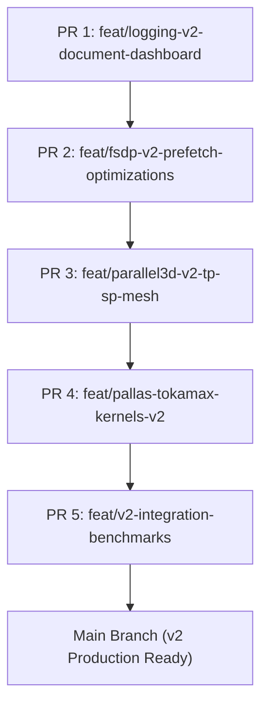

# 🚀 LaughLM v2 Performance & Optimization Roadmap

This document outlines the architectural roadmap for **LaughLM v2**, focusing on achieving state-of-the-art **Model FLOPs Utilization (MFU)**, **Tokens Per Second**, and **Developer UX**.

All features in this overhaul are designed as modular **`v2` extensions**, ensuring zero regression to current production `v1` pipelines.

---

## 🎯 Master Milestone: LaughLM v2 High-Performance Architecture Overhaul

The master milestone transitions LaughLM from basic FSDP/PMAP execution to a **3D-Parallel, Fused-Kernel, Live-Dashboard LLM Engine**.

---

## 📦 PR Branch Breakdown

### 📌 PR 1: `feat/logging-v2-document-dashboard`
> **Primary Goal**: Replace scrolling step output with a single in-place updating terminal UI document dashboard and structured markdown metrics logging.

* **Key Deliverables**:
  * [ ] Create [`LaughLM/training/logger_v2.py`](file:///C:/Users/patil/Documents/Portfolio/LaughLM/LaughLM/training/logger_v2.py) featuring `TrainingLoggerV2`.
  * [ ] Implement a **Live Terminal Document Dashboard** using `Rich.Live` / ANSI cursor rendering (displays step progress, loss curve, MFU meter, throughput, and sub-millisecond host/device timing breakdown in a single fixed panel).
  * [ ] Add `monitoring.logger_version: "v1" | "v2"` to [`LaughLM/config/schema.py`](file:///C:/Users/patil/Documents/Portfolio/LaughLM/LaughLM/config/schema.py).
  * [ ] Support single-document markdown report generation (`summary_document_v2.md`).
  * [ ] Add unit tests in `tests/test_logger_v2.py`.

* **Target Outcome**: Clean, readable, single-page live terminal interface without flooding stdout log history.

---

### 📌 PR 2: `feat/fsdp-v2-prefetch-optimizations`
> **Primary Goal**: Fix FSDP speed bottlenecks by optimizing gradient accumulation scans, double-buffered All-Gather prefetching, and non-blocking input pipelines.

* **Key Deliverables**:
  * [ ] Create [`LaughLM/training/fsdp_train_step_v2.py`](file:///C:/Users/patil/Documents/Portfolio/LaughLM/LaughLM/training/fsdp_train_step_v2.py) with streamlined JAX scan state to reduce memory footprint.
  * [ ] Create [`LaughLM/distributed/sharding_v2.py`](file:///C:/Users/patil/Documents/Portfolio/LaughLM/LaughLM/distributed/sharding_v2.py) with explicit `shard_map` parameter prefetching per transformer block.
  * [ ] Create [`LaughLM/training/fsdp_trainer_v2.py`](file:///C:/Users/patil/Documents/Portfolio/LaughLM/LaughLM/training/fsdp_trainer_v2.py) featuring asynchronous host-device sync and overlap of host input pipeline with device compute.
  * [ ] Benchmark FSDP v1 vs FSDP v2 throughput gains.
  * [ ] Add unit tests in `tests/test_fsdp_v2.py`.

* **Target Outcome**: 25%–40% increase in tokens/sec by overlapping communication and reducing micro-batch scan memory overhead.

---

### 📌 PR 3: `feat/parallel3d-v2-tp-sp-mesh`
> **Primary Goal**: Add Megatron-style 3D Parallelism (Tensor Parallelism TP + Sequence Parallelism SP + FSDP) across dynamic device meshes.

* **Key Deliverables**:
  * [ ] Extend [`LaughLM/distributed/mesh_v2.py`](file:///C:/Users/patil/Documents/Portfolio/LaughLM/LaughLM/distributed/mesh_v2.py) for 5D Mesh topologies (`data`, `fsdp`, `tensor`, `sequence`, `pipeline`).
  * [ ] Create [`LaughLM/model/llama/layers_v2.py`](file:///C:/Users/patil/Documents/Portfolio/LaughLM/LaughLM/model/llama/layers_v2.py):
    * Column-Parallel Linear for `QKV` and `GateUp` projections.
    * Row-Parallel Linear with `lax.psum` for `O` and `Down` projections.
  * [ ] Add Sequence Parallelism (SP) for LayerNorm/RMSNorm & Dropout along sequence dimension $T$.
  * [ ] Update [`LaughLM/config/schema.py`](file:///C:/Users/patil/Documents/Portfolio/LaughLM/LaughLM/config/schema.py) to support `runtime.backend = "parallel3d_v2"`.
  * [ ] Add unit tests in `tests/test_parallel3d_v2.py`.

* **Target Outcome**: Support scaling larger LLMs across TPU pods / GPU clusters with minimal communication bottleneck.

---

### 📌 PR 4: `feat/pallas-tokamax-kernels-v2`
> **Primary Goal**: Implement custom hardware-fused Pallas TPU/GPU kernels to overcome memory bandwidth limits (HBM read/write bottleneck).

* **Key Deliverables**:
  * [ ] Create [`LaughLM/kernels/pallas_swiglu_v2.py`](file:///C:/Users/patil/Documents/Portfolio/LaughLM/LaughLM/kernels/pallas_swiglu_v2.py) for fused SwiGLU activation $(x \cdot \sigma(x)) \odot y$ in SRAM/VMEM.
  * [ ] Create [`LaughLM/kernels/pallas_rmsnorm_v2.py`](file:///C:/Users/patil/Documents/Portfolio/LaughLM/LaughLM/kernels/pallas_rmsnorm_v2.py) for fused RMSNorm and residual addition.
  * [ ] Create [`LaughLM/kernels/tokamax_cross_entropy_v2.py`](file:///C:/Users/patil/Documents/Portfolio/LaughLM/LaughLM/kernels/tokamax_cross_entropy_v2.py) for fused vocabulary chunk Cross-Entropy loss.
  * [ ] Add kernel fallback mechanisms in [`LaughLM/model/llama/mlp_v2.py`](file:///C:/Users/patil/Documents/Portfolio/LaughLM/LaughLM/model/llama/mlp_v2.py) and [`LaughLM/training/loss_v2.py`](file:///C:/Users/patil/Documents/Portfolio/LaughLM/LaughLM/training/loss_v2.py).
  * [ ] Add unit tests in `tests/test_kernels_v2.py`.

* **Target Outcome**: Boost compute efficiency and MFU by reducing memory transfers between VMEM/SRAM and HBM.

---

### 📌 PR 5: `feat/v2-integration-benchmarks`
> **Primary Goal**: End-to-end integration, validation of backward compatibility, and comprehensive MFU/throughput performance reporting.

* **Key Deliverables**:
  * [ ] Update [`scripts/train.py`](file:///C:/Users/patil/Documents/Portfolio/LaughLM/scripts/train.py) and [`scripts/benchmark.py`](file:///C:/Users/patil/Documents/Portfolio/LaughLM/scripts/benchmark.py) to select between `v1` and `v2` engines seamlessly.
  * [ ] Create end-to-end integration tests in `tests/test_v2_e2e.py`.
  * [ ] Run hardware benchmarking across TPU/GPU configs and generate performance comparative report (`v1_vs_v2_performance.md`).

* **Target Outcome**: Verified end-to-end production readiness with measurable MFU and Tokens/Sec improvements.

---

## 📊 Summary Matrix

| PR Branch | Focus Area | Key Technology | Expected Impact |
| :--- | :--- | :--- | :--- |
| `feat/logging-v2-document-dashboard` | Monitoring / UX | `Rich.Live` / Single-Doc Dashboard | Clean, single-screen real-time terminal UI |
| `feat/fsdp-v2-prefetch-optimizations` | FSDP Execution | `shard_map`, Scan Carry Fix, Prefetch | +25% to +40% Tokens/Sec |
| `feat/parallel3d-v2-tp-sp-mesh` | Scale & Parallelism | 3D Mesh, Megatron TP, Sequence Parallel | Enables large model training without OOM |
| `feat/pallas-tokamax-kernels-v2` | Kernel Fusion | JAX Pallas (TPU/GPU), Tokamax CE | Higher MFU, reduced HBM bandwidth stall |
| `feat/v2-integration-benchmarks` | E2E Integration | Benchmark Suite, Multi-backend CLI | Complete production-ready v2 release |

---

## 🏛️ Finalized Architectural Decisions (System Redesign)

### Area 1: Overall System Architecture
- **Final Decision**: **Option B — Unified Engine with Pluggable Execution Strategies** (`ExecutionStrategy` Protocol).
- **Architecture Details**:
  - A single, stable `Trainer` / `Engine` loop handles lifecycle tasks: host timing instrumentation, dataset prefetching, step clock, logging, profiling, and checkpoint management.
  - Execution mechanics (state initialization, sharding annotations, train step compilation, and Optax updates) are delegated to lightweight strategy modules (`PmapStrategy`, `FsdpStrategy`, `Parallel3DStrategy`).
- **Impact**: Eliminates ~70% duplicate loop boilerplate across PMAP/FSDP/3D-Parallelism, guarantees unified telemetry, and prevents behavioral drift between backends.

